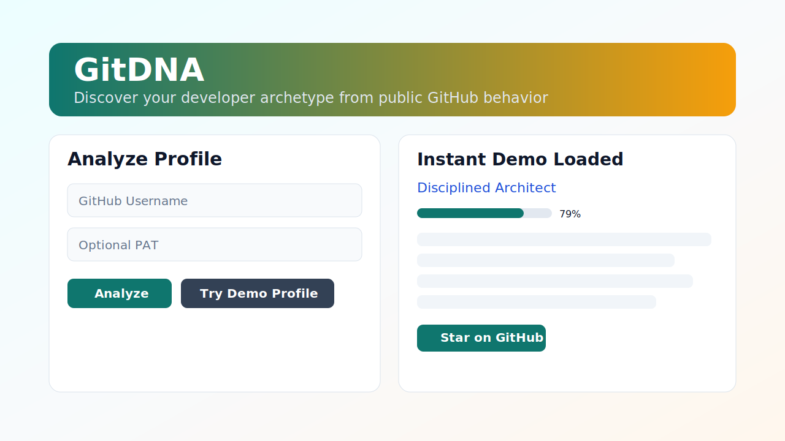
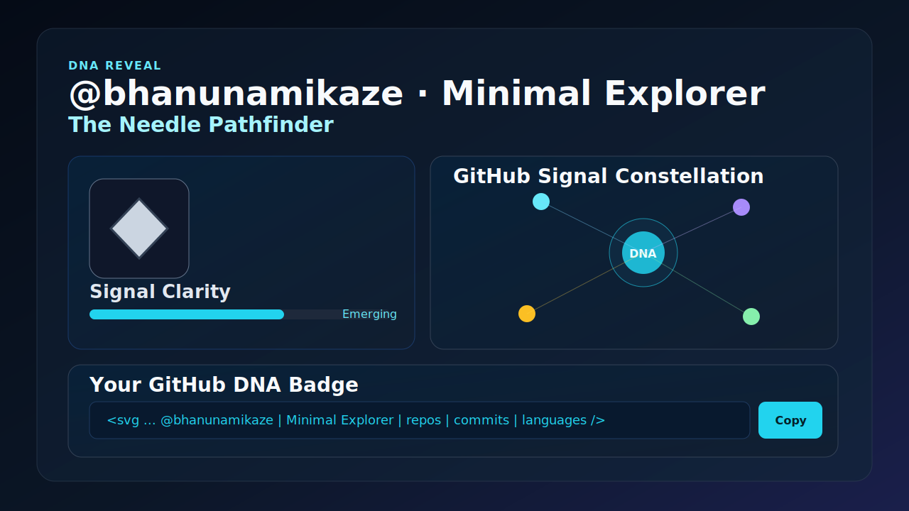
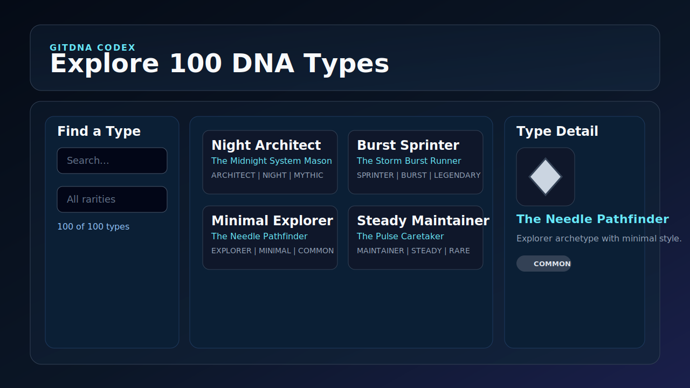

# GitDNA

Discover your Developer DNA from public GitHub activity.

- Interactive scan flow: Landing -> Scan -> DNA Reveal -> Constellation -> Badge Studio
- Deterministic 100-type system (`10 archetypes x 10 modifiers`)
- Explainable scoring with live GitHub signals and achievement impact
- Customizable GitDNA badge (README-ready markdown + SVG embed code)
- 100% free stack: GitHub Pages + GitHub Actions

## Live Product
- https://bhanunamikaze.github.io/GitDNA/

## Quick Start
1. Install Node.js 20+.
2. Run local dev server:
   ```bash
   npm run dev
   ```
3. Open `http://localhost:4173`.
4. Analyze a username, or click `Try Demo`.
5. Explore full catalog at `http://localhost:4173/codex.html`.

Optional local generation:
```bash
npm run generate:data
# or
node scripts/generate_types_json.js
node scripts/generate_readme_cards.js
node scripts/generate_profile_pages.js
```

## README Embed Snippet
Use a generated card URL:

```markdown

```

Example demo cards in this repo:
- `data/cards/torvalds.svg`
- `data/cards/tj.svg`
- `data/cards/sindresorhus.svg`

## Data Files (Names, Types, Characters)
- Type metadata (technical + alias + flavor + rarity): `data/dna/types_100.json`
- Archetype source data: `data/dna/archetypes.json`
- Modifier source data: `data/dna/modifiers.json`
- Character archetype shape config: `data/characters/archetype_shapes.json`
- Character modifier palette config: `data/characters/modifier_palettes.json`

## Screenshots
Landing scanner and DNA core:



DNA reveal, constellation, and badge studio:



DNA codex explorer (100 types):



## Hall of Fame
Submit via issue template:
- `.github/ISSUE_TEMPLATE/hall_of_fame_submission.yml`

Approved submissions are compiled into:
- `data/hall_of_fame.json`

## Docs
Start here:
- `docs/README.md`
- `docs/TASKS.md`

## Contributing
See:
- `CONTRIBUTING.md`
